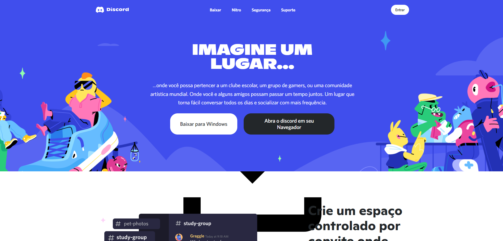

# Projeto Discord Clone

Este projeto é um clone do site oficial do Discord, criado com fins educacionais. Ele demonstra habilidades em desenvolvimento web front-end, utilizando HTML, CSS e JavaScript para recriar a interface de apresentação do Discord.

## Descrição

O projeto replica a página inicial do Discord, incluindo elementos visuais como fontes personalizadas, estilos responsivos e interações básicas. Foi desenvolvido como parte de um curso de JavaScript na Udemy, ministrado por Jamilton Damasceno.

## Tecnologias Utilizadas

- **HTML5**: Estrutura da página
- **CSS3**: Estilização, incluindo fontes personalizadas (Ginto e Whitney)
- **JavaScript**: Interações e funcionalidades dinâmicas

## Como Executar

1. Clone o repositório:
   ```
   git clone https://github.com/CarvalhoJ98/Discord.git
   ```

2. Navegue até a pasta do projeto:
   ```
   cd discord
   ```

3. Abra o arquivo `index.html` em seu navegador web.

Não há dependências externas ou servidor necessário, pois é um projeto estático.

## Screenshots



## Estrutura do Projeto

- `index.html`: Página principal
- `textos.html`: Conteúdo adicional
- `css/`: Arquivos de estilo
  - `style.css`: Estilos principais
  - `font.ginto.css` e `font.whitney.css`: Fontes personalizadas
- `js/`: Scripts JavaScript
  - `stylesheet.js`: Lógica principal
- `fonts/`: Arquivos de fonte
- `img/`: Imagens utilizadas

## Licença

Este projeto está licenciado sob a ISC License.

## Autor

Desenvolvido por João Vitor como parte do portfólio de migração de área. Baseado no curso de Jamilton Damasceno na Udemy.

---

*Nota: Este é um projeto educacional e não tem afiliação com a Discord Inc.*
